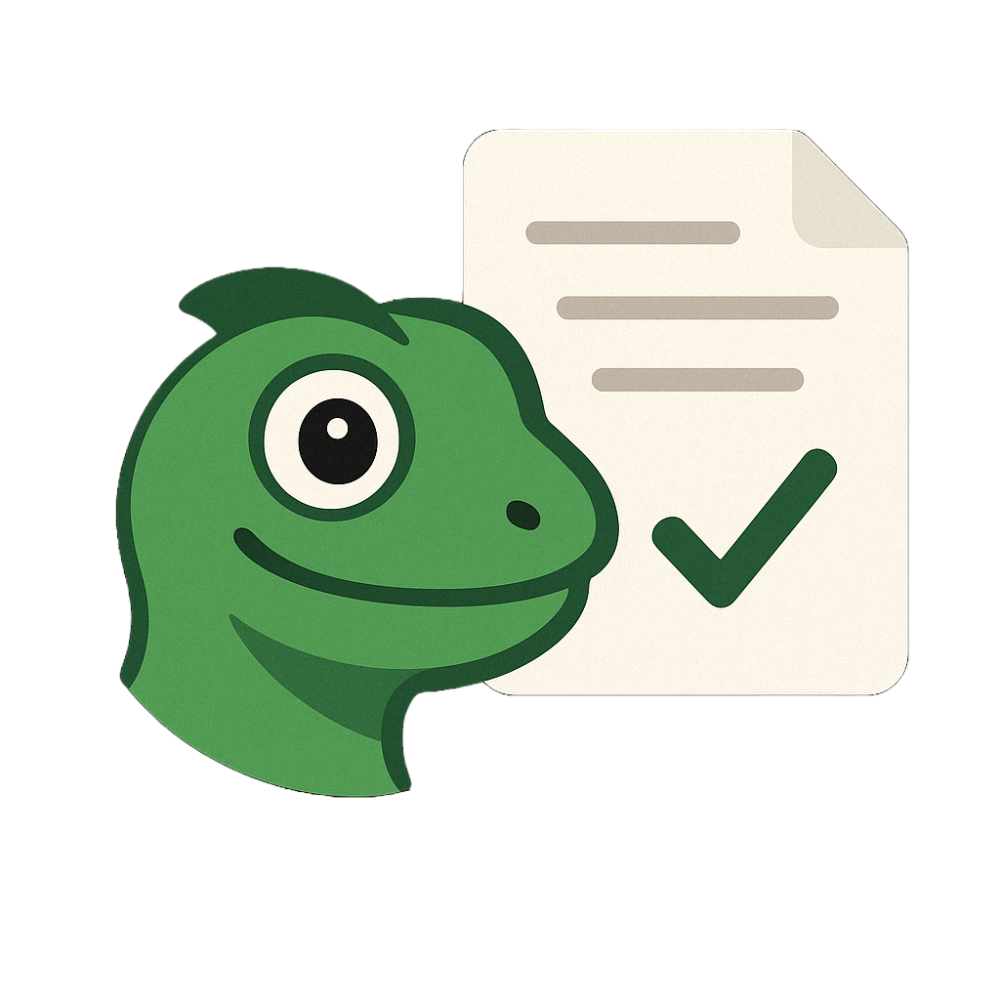
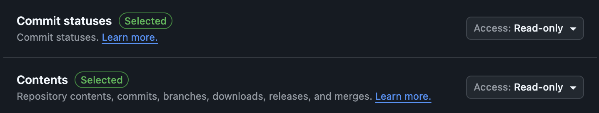
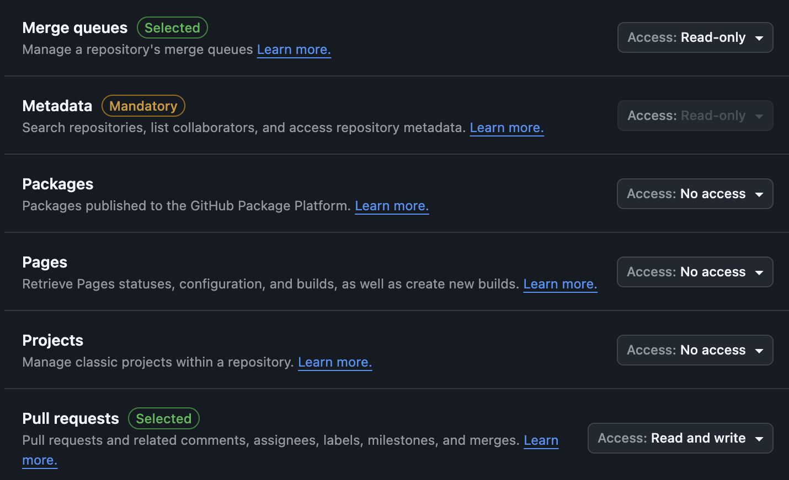
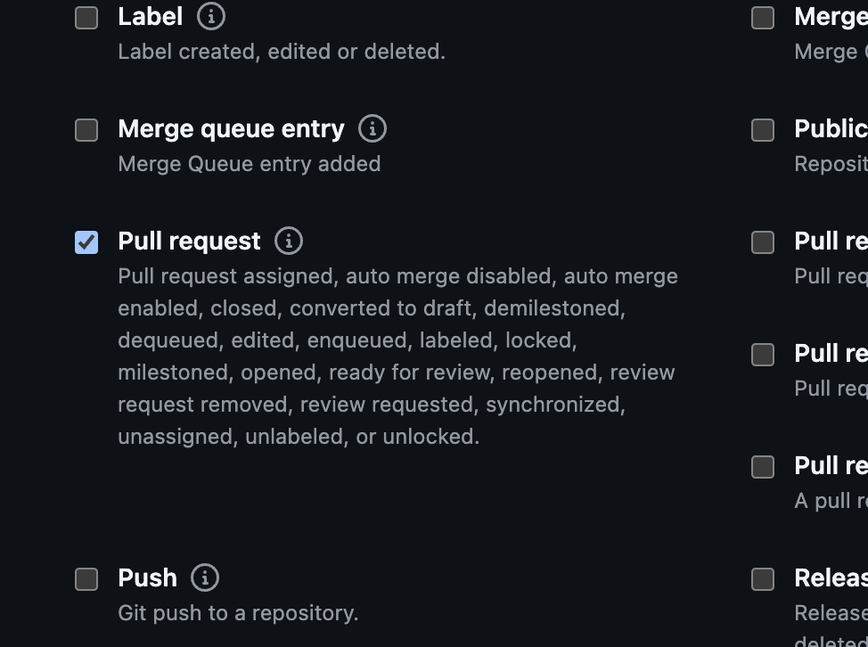

# Reptilog

  

> An AI-powered changelog inspired by [Greptile](https://greptile.com). Built with [Probot](https://github.com/probot/probot) and [OpenAI](https://openai.com/index/hello-gpt-4o/) for the backend, [Next.js](https://nextjs.org/) with the App Router, [Lowdb](https://github.com/typicode/lowdb) for data storage, [Tailwind CSS](https://tailwindcss.com/) for styling, [Framer Motion](https://www.framer.com/motion/) for animations, and [Lucide](https://lucide.dev/) for icons.

- After merging a PR to your production branch, Reptilog uses LLMs to translate the data associated with all the commits of that PR (including commit message, changes per file, etc.) into a user friendly changelog.

## Demo

  

- Updated UI/UX--Markdown support within changelog entries:

  

## How does it work?

Reptilog is composed of a GitHub bot and a frontend user-facing website. The GitHub bot code is within `reptilog-backend`, and the website code is within `reptilog-frontend`. 

With the GitHub bot installed onto your GitHub repository (or repositories) of choice and both the frontend and backend running (see the "Get Started" section below for more information), you can create a PR to a main/master branch, and the bot is activated once your PR is merged (via the `pull_request.closed` GitHub webhook). The bot then fetches the appropriate commits corresponding to your pull request on that repo and sends all the information within the commits (including commit messages, file diffs, etc.) to an OpenAI LLM. Via some clever prompting, the LLM constructs a user-friendly changelog using all the commits it was given. The LLM then returns a properly structures JSON object containing a markdown-formatted changelog title and description for that PR. The JSON message is subsequently sent from the GitHub bot to the frontend via a POST request to the frontend. Upon receiving this POST request, the user-facing website then writes to its JSON database with the new changelog and its metadata (date, PR #, etc).

The developer doesn't need to worry about a thing. All they need to do is create the PR, and the changelog is automatically generated within less than a minute. Upon refresh, the website fetches the latest changelogs stored within the database, sorted from newest to oldest, and in paginated format.

## Get Started

1. Clone the repository.

2. Download dependencies for both portions (`npm i` from the `reptilog-frontend` and `reptilog-backend` directories).

3. Create a GitHub bot on your GitHub account and install it onto a repository of your choice. Make sure the permissions shown in the images below are selected for your GitHub bot. In order to link your GitHub bot to your locally-cloned repository, make sure to take a look at `./reptilog-backend/.env.example`. You can find most of the `.env` variables within the main page of your GitHub bot settings. For more information on connecting the bot, read [this](https://probot.github.io/docs/development/#manually-configuring-a-github-app) from Probot's docs. You will need an [OpenAI](https://platform.openai.com/docs/overview) key as well. Also, make sure to set up your `.env` file within the `reptilog-frontend` as well. Check the `./reptilog-frontend/.env.example`.

  

    
  

  
  

    
  

  
  

    
  

4. Run `npm run dev` from the `reptilog-frontend` directory. Then open a new terminal window and run `npm run build` followed by `npm start` from the `reptilog-backend` directory. The frontend will run on localhost with port 3001, and the backend will run on localhost with port 3000.

5. Create a pull request to a production branch (main/master) of the repository with the GitHub bot installed. Make sure the frontend and backend are running. If everything is set up correctly and you refresh the page of your frontend (localhost:3001), your latest changelog will display at the top of the first page of changelogs.

## Design Choices
#### Developer-facing design choices
A big decision for me was how and when to create a changelog entry. Initially, I wanted to make it such that a developer could create a GitHub issue with a special tag, which would summon the reptilog and create the changelog for all of the commits between the most recent commit and the last changelog. I eventually settled on having the GitHub bot automatically create a changelog based on the commits of a pull request to a main/master branch. 

A lot of companies operate with a "main development" branch, to which everyone merges their own branch changes onto. When an official release is made, a pull request is created from the "main development" branch to the main/master branch, in order to make things available to the users of the product. This is a clean and efficient solution that allows for very clear boundaries of a product's versioning. Conveniently, these pull requests to a production branch create a nice partitioning that works well for changelogs too. In the context of a customer-facing API: when would you need to deploy your production branch without notifying your users of incoming changes? For the most part I think the answer to that question is "never". Thus, I think it was the better route to take, as supposed to the arbitrary nature of creating a changelog at any random time via the human creation of a GitHub issue with a specific tag.

#### Public-facing design choices
For the public, I focused on a Greptile-inspired design. I imitated Greptile's beautiful and simple navbar, along with the grid pattern on their landing page. I also made sure to get the highlighting of the various links on the navbar right, and ensured the highlighting was the same color for every single link on the page. For the changelog entries, I went for a bit of a different approach; I used a dropdown-style changelog, where users can click on the dropdown to display the details of a specific changelog entry. Overall, the ui of the frontend makes for a simple and straightforward user experience.

## AI Tools used
For development I use **Cursor** and Anthropic's Claude-3.7-sonnet; Cursor was immensely useful when I needed help going through documentation and solving annoying linter issues. I normally use MCPs to work with frontend code, but this time I didn't need to use any MCPs (I usually like to use the MagicUI MCP when dealing with MagicUI components).

## License

[ISC](LICENSE) © 2025 Giovanni Assad
